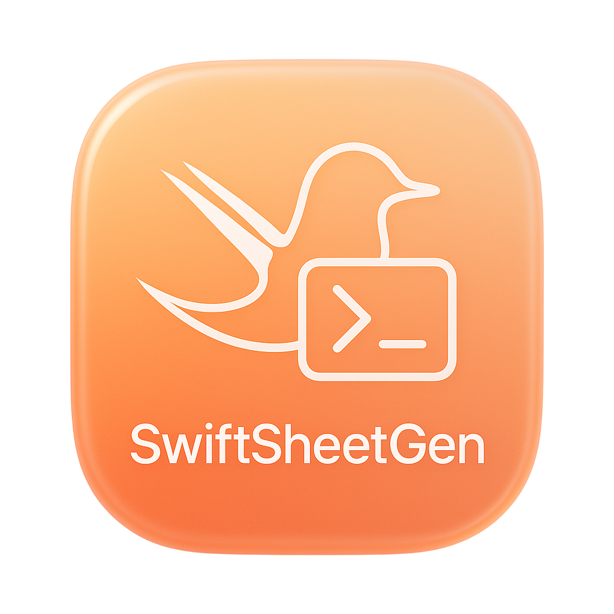

# SwiftSheetGen

<p align="center">
  
</p>

<p align="center">
  <strong>Generate type-safe Swift code for localizations and colors directly from a Google Sheet.</strong>
</p>

<p align="center">
  <a href="https://github.com/jorge/SwiftSheetGen/actions"></a>
  <a href="https://swift.org"></a>
  <a href="/LICENSE"></a>
</p>

---

**SwiftSheetGen** is a command-line tool that transforms your team's collaborative Google Sheets for strings and colors into compile-time safe Swift code, eliminating manual errors and keeping your Xcode project in perfect sync.

## Overview

Manually managing localizable strings and design system colors is tedious and error-prone. A typo in a key, a color hex copied incorrectly, or a file not added to the Xcode project can lead to runtime crashes and UI inconsistencies.

SwiftSheetGen solves this by using a **Google Sheet as a single source of truth**. This allows designers, translators, and developers to collaborate in one place, while the tool automates the generation of type-safe Swift code that you can use with confidence.

## Installation

### Homebrew (Recommended)
```bash
brew install jorge/tap/swiftsheetgen
```

### From Source
Build the tool from the source and move it to a location in your `PATH`.
```bash
git clone https://github.com/jorge/SwiftSheetGen.git
cd SwiftSheetGen
swift build -c release
sudo cp .build/release/swiftsheetgen /usr/local/bin/
```

## Quick Start

1.  **Install the tool** via Homebrew.

2.  **Get your Google Sheet URL.** The sheet must be public ("Anyone with the link can view"). Here is a valid URL:
    -   Published to web URL: `https://docs.google.com/spreadsheets/d/e/1a2b3c4d5e6f7g8h9i0j.../pubhtml`

3.  **Run the command:**
    ```bash
    # For localizations
    swiftsheetgen localization "https://docs.google.com/spreadsheets/d/YOUR_SHEET_ID/export?format=csv"

    # For colors
    swiftsheetgen colors "https://docs.google.com/spreadsheets/d/YOUR_SHEET_ID/export?format=csv&gid=YOUR_GID"
    ```
    This will generate the necessary files in a new subdirectory (`./Localizables` or `./Colors`). That's it!


## Detailed Usage Guide

### Commands

SwiftSheetGen has two main commands:

-   `localization`: Generates `.strings` files for each language and a type-safe `L10n` enum to access them.
-   `colors`: Generates a `Color` extension with static properties for your design system colors.

### Shared Options

These options are available for both the `localization` and `colors` commands:

| Option | Shorthand | Description | Default |
|---|---|---|---|
| `--output-dir` | | The directory where generated files will be saved. For Xcode integration, this must be the directory containing your `.xcodeproj` file. | `./` |
| `--verbose` | `-v` | Enable detailed logging for debugging. | `false` |
| `--keep-csv` | | Keep the downloaded CSV file for debugging purposes. | `false` |
| `--log-privacy-level` | | Set log privacy to `public` or `private`. | `public` |

### `localization` Specific Options

| Option | Description | Default |
|---|---|---|
| `--swift-enum-name` | Name for the generated Swift localization enum. | `L10n` |
| `--enum-separate-from-localizations` | Generate the Swift enum file in the base output directory instead of inside the `Localizables` subdirectory. | `false` |

## Integrations

### Xcode
The tool automatically integrates the generated files into your Xcode project.

- **Compatibility:** This feature is fully compatible with **Xcode 15 and newer**.
- **Older Xcode Versions:** On older versions, if files do not appear automatically, you may need to **drag and drop them manually from Finder** for the initial setup.

For the integration to work, the directory you specify in `--output-dir` **must be the one that contains your `.xcodeproj` file**.

### Tuist
If a `Project.swift` or `Workspace.swift` file is detected in your project's root, SwiftSheetGen will skip the automatic Xcode integration and print instructions for you to add the generated files to your Tuist manifest.

## Google Sheet Setup

Your Google Sheet must be **publicly accessible** ("Anyone with the link can view") and have a specific structure.

#### For Localizations
The sheet requires columns for `key`, `comment`, and each language code (e.g., `en`, `es`).

| key | comment | en | es |
|---|---|---|---|
| `login.title` | Title on the login screen | Welcome! | ¡Bienvenido! |
| `login.button.signIn` | Sign in button text | Sign In | Iniciar Sesión |

#### For Colors
The sheet requires columns for `name`, `anyHex`, `lightHex`, and `darkHex`.

| name | anyHex | lightHex | darkHex |
|---|---|---|---|
| `primary` | | `#68478E` | `#866CA5` |
| `onPrimary` | | `#FFFFFF` | `#00172E` |
| `background` | `#F2F2F7` | | |

## FAQ

**Q: How do I use a private Google Sheet?**
**A:** SwiftSheetGen requires the sheet to be publicly accessible to download the CSV data. You can achieve this by going to "File" > "Share" > "Publish to web" in Google Sheets and publishing it as a CSV document. This creates a public URL without making the sheet itself public.

**Q: Will you support the new Xcode Strings Catalog (`.xcstrings`)?**
**A:** Yes, support for the modern Xcode Strings Catalog is planned for a future release. This will allow for richer localization features and even better integration with Xcode.

**Q: Can I customize the generated Swift code?**
**A:** For localizations, you can use the `--swift-enum-name` option to change the name of the generated enum. Other customizations are not available at this time but may be considered for future versions.

**Q: What happens if the Xcode integration fails?**
**A:** If the files don't appear in your project, you can simply drag the generated output directory (`Localizables` or `Colors`) from Finder into your Xcode Project Navigator. Make sure to select your main app target when prompted.

## License

This project is licensed under the MIT License - see the [LICENSE](LICENSE) file for details.

